<!-- #region -->
# Skin Cancer Detection: Computer Vision and Deep Learning Techniques

#### By: Aditya Bajaj, Gerrit Lensink, Rohit Srinivas, Ruby Han

## Files in Repo
- `notebooks/EDA` folder for exploratory data analysis notebook
- `notebooks/Tuning` folder for model tuning notebooks
- `notebooks/Final Model` folder for final model notebook and pth file
- `notebooks/DCGAN` folder for DCGAN notebooks
- `notebooks/Testing` folder for testing notebooks
- `images` folder for images
- `W251_skinCancerWhitePaper.pdf` pdf file for final project white paper
- `skinCancerPresentation.pdf` pdf file for final project presentation
- `Pipeline/Image_folder` Final pipeline configuration - images in folder as input
- `Pipeline/Camera` pipeline configuration for future improvements. Not used

## Abstract

Our aim is to introduce an automated system which will be able to detect skin disease class in dermoscopic images in this paper. The assignment was defined by International Skin Imaging Collaboration (ISIC) with the purpose of improving melanoma detection. We utilized computer vision and deep learning modelling techniques through transfer learning by taking into account the imbalanced data in each class of the dataset. We attempted various networks with different width and depth and the best neural networks happened to be DenseNet and EfficientNet models. Our best accuracy is **0.783** with **EfficientNetB7** for test data of ISIC 2018 challenge.

## Introduction

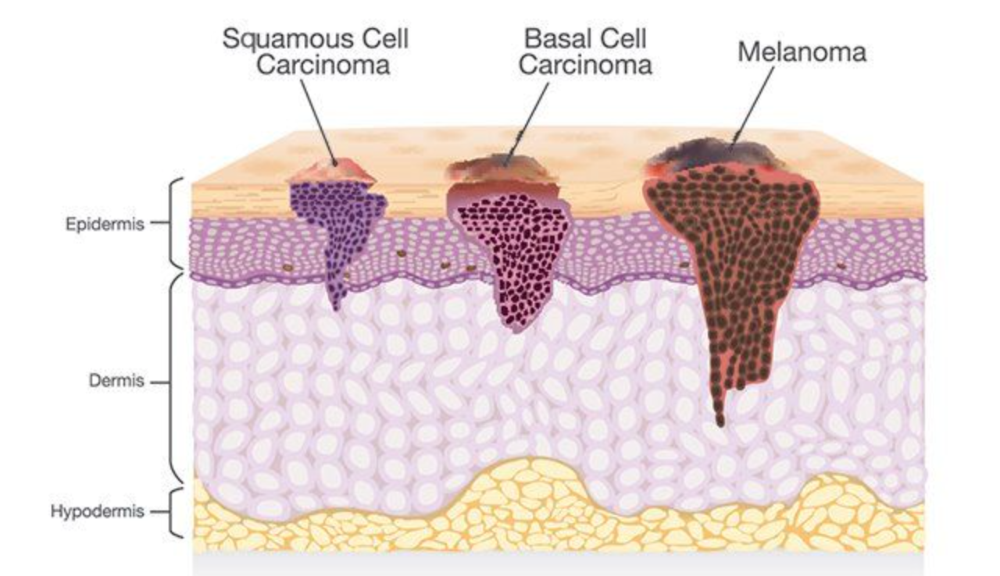

- Skin cancer is a debilitating condition.
- It greatly affects the quality of life and can be disfiguring or even lethal.
- Every year, nearly 5 million people are diagnosed with skin cancer. This whole field has an annual cost estimated at 8 billion dollars. 
- Despite efforts to combat skin cancer risk factors, the rates continue to rise. 
- Approximately 9000 people die from skin cancer each year. 
- However, even though skin cancer is the most commonly diagnosed cancer in the US, most cases are preventable.

## Goal

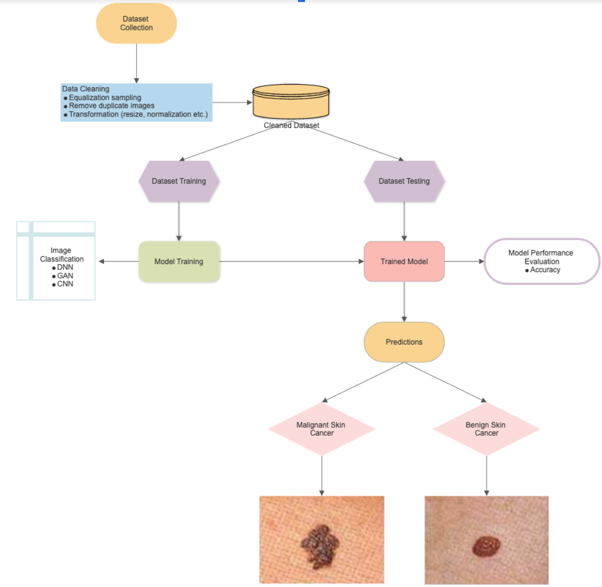

Our aim for the project is to introduce an automated system to detect skin lesion classes in dermoscopic images using deep learning techniques. We adhered to the competition rules of International Skin Imaging Collaboration or in short known as ISIC with the purpose of improving melanoma detection. This flow chart diagram demonstrates a high level overview of our modelling processes. First, we start with dataset collection followed by data cleaning/munging. After, we attempted to train and tune the models through image classification models such as GAN and CNNs. Our model performance metric is measured by accuracy. The resulting predictions are the seven classes of skin lesions (either benign or malignant).

## Edge to Cloud Pipeline

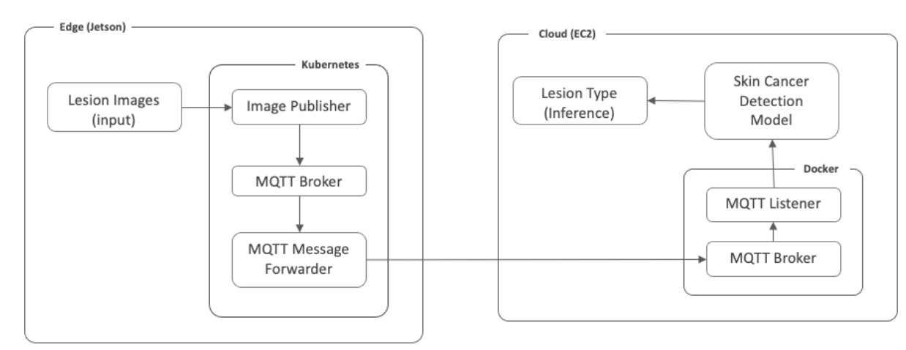

Our work seeks to expand on pre-existing skin cancer detection models by creating an end-to-end pipeline which receives user photos as input on an edge device and returns lesion type from a model deployed in the cloud. 

We created this system by passing user images from a Jetson Nano 4GB to our lesion-classification model, trained and deployed in the cloud.

## Dataset

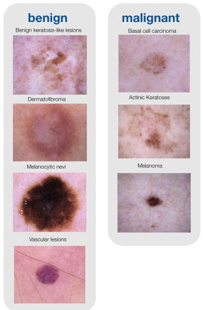

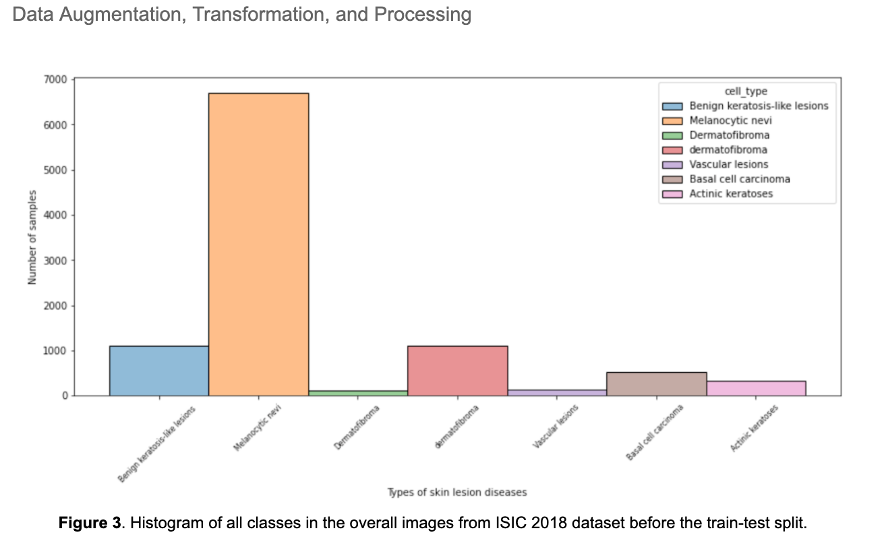

- 10,000 observations
- 2,500 images were originally believed to be duplicates
    - "Duplicate" images were identified with same lesion, with different resolution or transformation
- Dataset was augmented via equalization sampling to reduce class imbalance

## Data Augmentation - Microscopic Crop

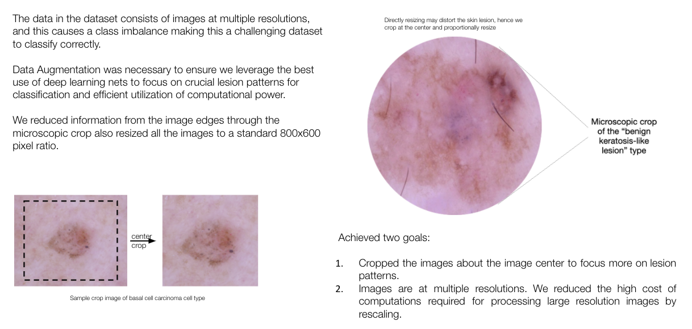

## Data Augmentation - Using DCGAN

- Generated images from complete noise using DCGAN, with five layers. 
- DCGAN was able to generate images around 1500th step.
- Some classes had just around 100 images, and leveraging DCGAN, we were able to increase the number images by 5x.
- Though the output image lacks cohesion and cannot be compared at a pixel level, it can still offer information to compare the sharpness and presence of malignancy markers and their fine-grained details.
- We had an overall better performance across Precision, Recall, and F1-Scores.

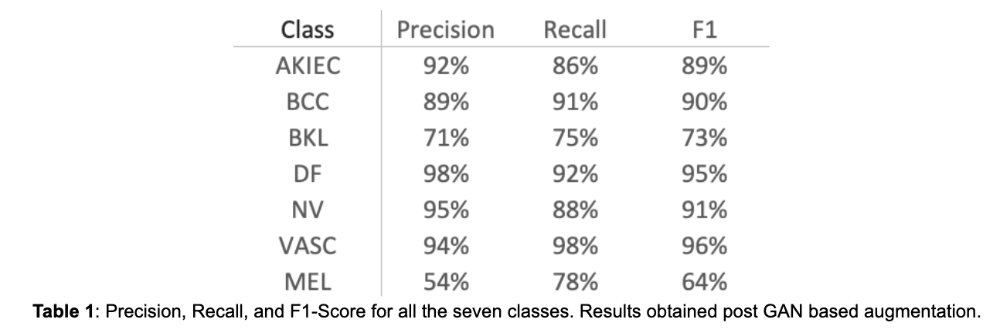

## Model Training

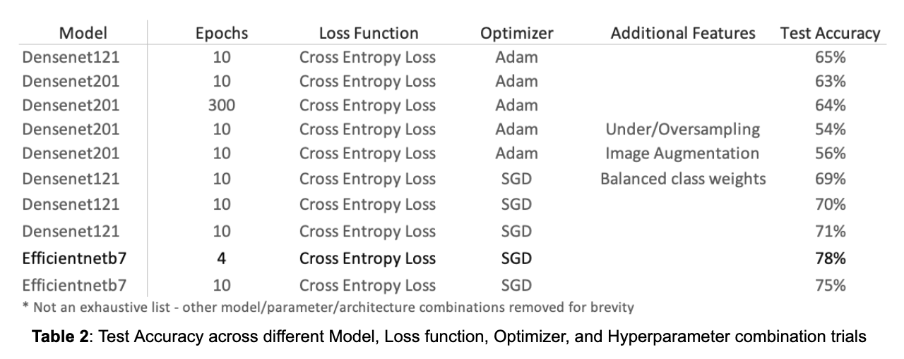

- Convolutional neural networks (CNNs) have superior performance when it comes to image classification. 
- CNNs have three main layers but it is the convolutional layers which extract information from the image. 
- The earlier convolutional layers focus on simple features such as colors, edges etc. and the later layers recognize the larger elements or shapes.
- Our original code base was borrowed from Xinrui Zhuang’s [kaggle submission](https://www.kaggle.com/xinruizhuang/skin-lesion-classification-acc-90-pytorch)

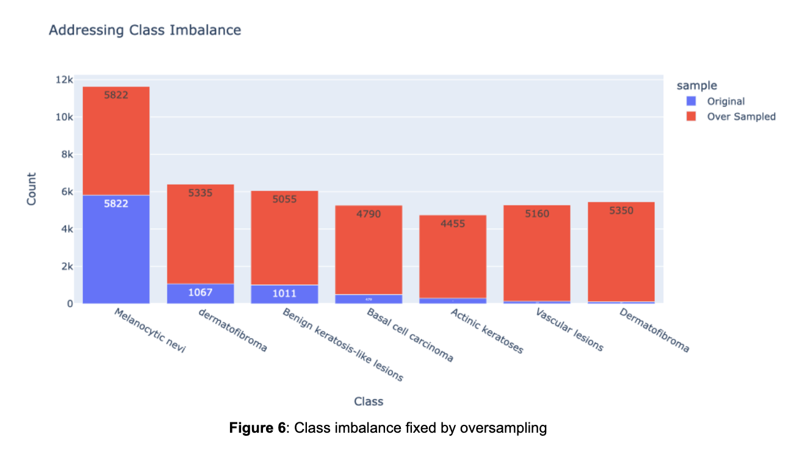

## Results
### Final Model

Our final application is able to read in images from an edge device, transmit to the cloud, and provide users with lesion classification within one second. Across 10 randomly selected lesion images from the internet, our model properly classified lesion-type 4 times, and cancerous/non-cancerous 7 times (Figure 7).

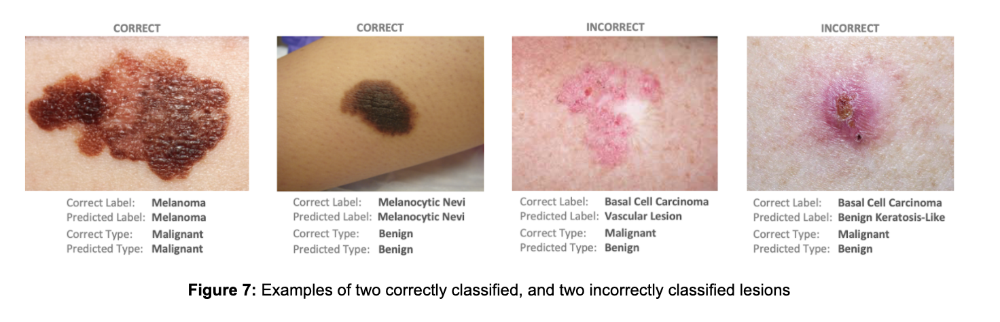

The table below shows the precision, recall and F-1 scores per class between the baseline model and the deployed model. The accuracy improved by 13% and the F1 Score for the minority classes improved by ~10%. Examples of correctly and incorrectly classified lesions are included in Figure 7.

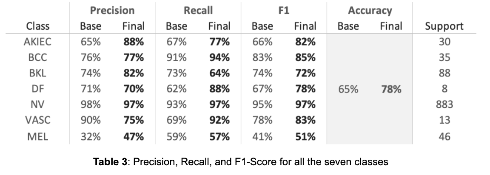

## Next Steps
- GAN images with Efficient Net
- GAN vs oversampling/undersampling
- Pruning Efficient Net to reduce model load time
- Exploring eternal sources of data
- Connect lesion detection software to webcam, allowing real-time classification
<!-- #endregion -->
