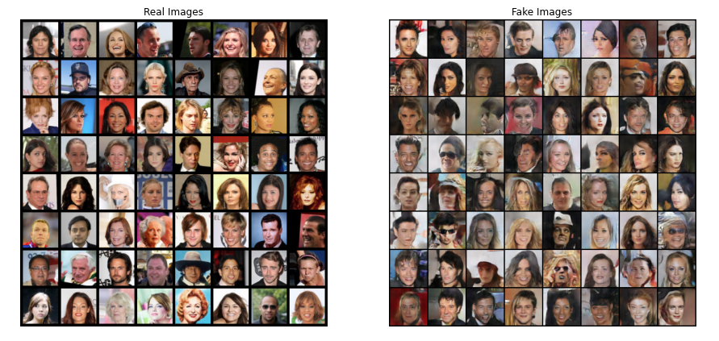

# Fall 2021 W251 Homework 10 - GANs refined

In this week's lab, you used a GAN to generate images of people that look like celebrities.

For this homework, you will re-run the lab with modifications to improve the quality of the generated images. The easiest improvements can be made by modifying values in the **_Inputs_** section

### Submission:
1. What changes did you make to the original lab? Did your changes result in higher quality images?

**Answer:**
Increased the number of epochs from 2 to 10. Yes, the changes did result in higher quality images.

2. In your own words, how does the Discriminator improve its ability to detect fakes?

**Answer:**
The weights of the discriminative network are updated so as to decrease its classification error. After tuning its weights for a couple of rounds, it gets better at distinguishing between real and fake samples.

3. Share a copy of the output image from the last step in the notebook (can be an upload to the ISVC Portal, or a link to the file in AWS Object Store).

**Answer:**

