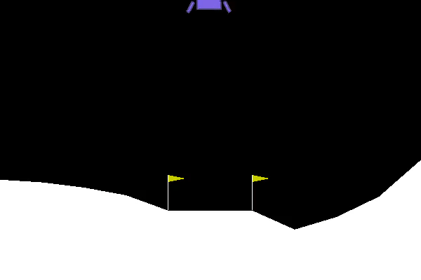

# Fall 2021 W251 Homework 11 - Fun with OpenAI Gym!

## Videos

### Training Episode 0
AWS S3 Object Cloud Storage Link: https://rubyhan-w251-hw11.s3.ca-central-1.amazonaws.com/episode0.mp4


### Training Episode 250  
AWS S3 Object Cloud Storage Link: https://rubyhan-w251-hw11.s3.ca-central-1.amazonaws.com/episode250.mp4


### Training Episode 450  
AWS S3 Object Cloud Storage Link: https://rubyhan-w251-hw11.s3.ca-central-1.amazonaws.com/episode450.mp4


### Test  Episode 0 and 50
AWS S3 Object Cloud Storage Link: https://rubyhan-w251-hw11.s3.ca-central-1.amazonaws.com/testing_run0.mp4

AWS S3 Object Cloud Storage Link: https://rubyhan-w251-hw11.s3.ca-central-1.amazonaws.com/testing_run50.mp4




## Run Commands

### Docker

```
# build docker container for training
docker build -t hw11 -f Dockerfile.4.4 .
```

```
# enable video sharing from the container
export DISPLAY=:0
xhost +
```

```
# start training
time docker run -it --rm --net=host --runtime nvidia  -e DISPLAY=$DISPLAY -v /tmp/.X11-unix/:/tmp/.X11-unix:rw --privileged -v /data/videos:/tmp/videos hw11
```

```
# rename *.h5 file to mymodel.h5
# build docker container for testing
docker build -t testlander -f Dockerfile.test .
```

```
# start testing
time docker run -it --rm --net=host --runtime nvidia  -e DISPLAY=$DISPLAY -v /tmp/.X11-unix/:/tmp/.X11-unix:rw --privileged -v /data/videos:/tmp/videos testlander
```

## Q&A Submission

1. What parameters did you change, and what values did you use?

- Updated `self.density_first_layer` to 512 (increases model ability to produce a solution to an increasingly complex problem)
- Updated `self.density_second_layer` to 256 (increases model ability to produce a solution to an increasingly complex problem)
- Updated `self.density_third_layer` to 256 (increases model ability to produce a solution to an increasingly complex problem)
- Updated `self.density_fourth_layer` to 64 (increases model ability to produce a solution to an increasingly complex problem)
- updated loss function `mean_absolute_error` (this metric better represents the cumulative reward system of the lunar landing reinforcement learning task)

```
        #######################
        # Change these parameters to improve performance
        self.density_first_layer = 512 #16
        self.density_second_layer = 512 #8
        self.density_third_layer = 256
        self.num_epochs = 1
        self.batch_size = 64
        self.epsilon_min = 0.01

        # epsilon will randomly choose the next action as either
        # a random action, or the highest scoring predicted action
        self.epsilon = 1.0
        self.epsilon_decay = 0.995
        self.gamma = 0.99

        # Learning rate
        self.lr = 0.001

        #######################
        
        # Compile the model
        model.compile(loss=mean_absolute_error,optimizer=Adam(lr=self.lr))
```

Output:

```
# train
495     : Episode || Reward:  87.8425508409785  || Average Reward:  196.17831175833933   epsilon:  0.0832238973628649
DQN Training Complete...

real    54m35.297s
user    0m0.392s
sys     0m0.212s

# test
90      : Episode || Reward:  259.05119610428477
91      : Episode || Reward:  274.41323362502595
92      : Episode || Reward:  326.4593589160079
93      : Episode || Reward:  241.63488513628266
94      : Episode || Reward:  287.4670208808213
95      : Episode || Reward:  240.206093200603
96      : Episode || Reward:  307.63723525774935
97      : Episode || Reward:  315.5974633603962
98      : Episode || Reward:  260.9025100331868
99      : Episode || Reward:  317.0788894013589
Average Reward:  233.87479791212473
Total tests above 200:  85

real    5m4.336s
user    0m0.104s
sys     0m0.084s
```

2. Did you try any other changes (like adding layers or changing the epsilon value) that made things better or worse?

- Changing layer densities and updating loss function to `mean_absolute_error` increased model performance
- Adding a `self.density_third_layer` of 128 and reverting loss function back to `mean_squared_error` decreased model performance and prolonged training time
- Increasing `self.num_epochs` to 20 decreased model performance and prolonged training time
- Updating `self.epsilon_decay` to 0.999 decreased model performance and prolonged training time

Output:

```
# Modification 1
# 512
# 256
# 128

# train
548     : Episode || Reward:  261.72657635739404        || Average Reward:  199.71532189778986   epsilon:  0.06380744126877576
DQN Training Complete...

real    73m41.525s
user    0m0.616s
sys     0m0.160s

# test
90      : Episode || Reward:  245.65432280118884
91      : Episode || Reward:  251.04213431347043
92      : Episode || Reward:  145.80987718662843
93      : Episode || Reward:  263.8187914596032
94      : Episode || Reward:  195.28646123698616
95      : Episode || Reward:  250.91453213383613
96      : Episode || Reward:  228.44478652074912
97      : Episode || Reward:  263.8063644645598
98      : Episode || Reward:  264.6746806094669
99      : Episode || Reward:  256.23818909964575
Average Reward:  235.6548641488902
Total tests above 200:  88

real    8m11.683s
user    0m0.120s
sys     0m0.112s

# Modification 2
# MAE
# 512
# 256
# 64

# train
860     : Episode || Reward:  292.400038075476  || Average Reward:  198.042654484727     epsilon:  0.01335588042198471
DQN Training Complete...

real    92m49.295s
user    0m0.716s
sys     0m0.276s

# test
95      : Episode || Reward:  250.46873083888806
96      : Episode || Reward:  226.16388116879256
97      : Episode || Reward:  261.1360193979973
98      : Episode || Reward:  258.9145711162787
99      : Episode || Reward:  213.89130587847626
Average Reward:  243.57485045132117
Total tests above 200:  88

real    6m57.256s
user    0m0.124s
sys     0m0.056s

# Modification 3
# MAE
# 512
# 256
# epsilon_decay = 0.999

# train
1999    : Episode || Reward:  285.9635738049097         || Average Reward:  198.35748975923698   epsilon:  0.1351999253974994

real    143m20.854s
user    0m1.116s
sys     0m0.300s

# test
90      : Episode || Reward:  230.20669343919005
91      : Episode || Reward:  246.97670606795077
92      : Episode || Reward:  213.3087111809134
93      : Episode || Reward:  206.5452639157583
94      : Episode || Reward:  271.99593126198977
95      : Episode || Reward:  277.2799563532483
96      : Episode || Reward:  271.9261809373879
97      : Episode || Reward:  245.49082976802194
98      : Episode || Reward:  30.54646712756704
99      : Episode || Reward:  283.28922728026686
Average Reward:  229.65756966117314
Total tests above 200:  89

real    6m30.485s
user    0m0.132s
sys     0m0.052s
```

3. Did your changes improve or degrade the model? How close did you get to a test run with 100% of the scores above 200?

- Changes to density and number of layers greatly improved the model
- 96% tests with scores above 200 achieved

4. Based on what you observed, what conclusions can you draw about the different parameters and their values?

- Changes to the density and number layers produced the greatest effect to account for model complexity
- Changing the loss function from `mean_squared_error` to `mean_absolute_error` better represents the metric for this task
- Additional nodes did not always increase model performance due to potential overfitting
- The `relu` activation function is appropriate to use between layers
- The epsilon decay needs to be optimized to ensure sufficient randomness in training simulations so that the model is able to explore many actions prior to finding one that returns optimal Q-score

5. What is the purpose of the epsilon value?

- The epsilon value is the probability of selecting a random state rather than the highest Q-score
- It allows the model to explore the state space and causes new action to be taken every now and then (exploration)
- As the model improves, the epsilon value is decreased so there is less randomness (exploitation)
- The epsilon decay should produce a better model when used effectively

6. Describe "Q-Learning".


Components:

Agent = Decision maker and learner

State = State of the agent within the environment

Reward = A reward is given for each action taken by the agent (usually a scalar value)

Environment = Provides several states for the agent to choose from

Action = A set of actions the agent is able to perform

- Type of reinforcement learning using the Q-table in memory (states x action)
- Each state-action has a corresponding Q-value (reward)
- Seeks to determine best action given current state
- Seeks to learn a policy that maximizes the total reward
- The environment provides multiple states for the agent select and is rewarded based on its action
- The agent is trained to maximize rewards