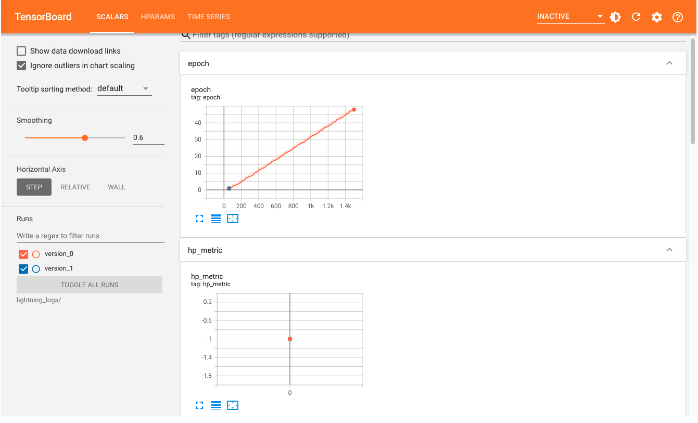
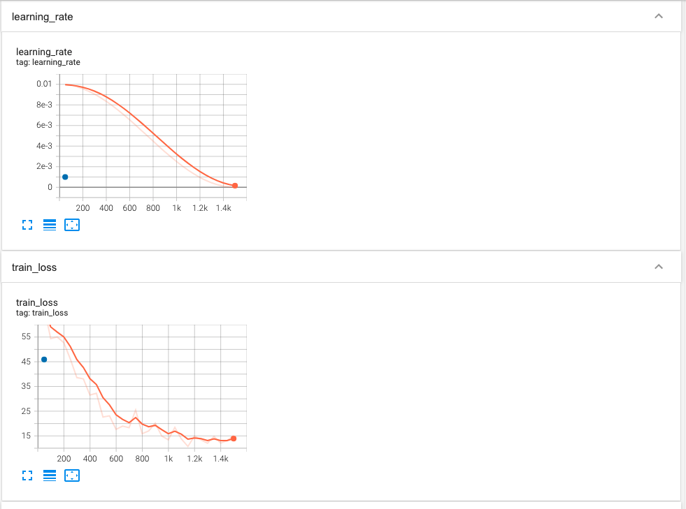
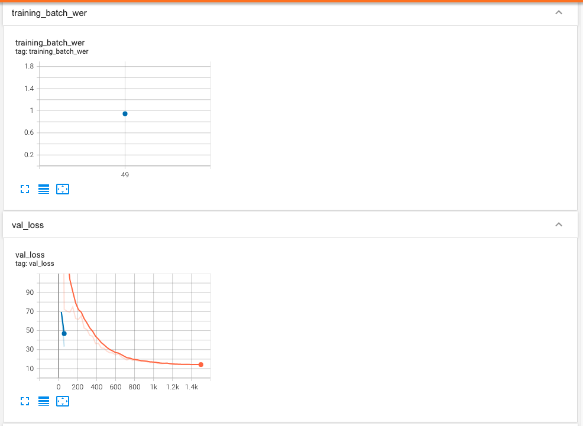
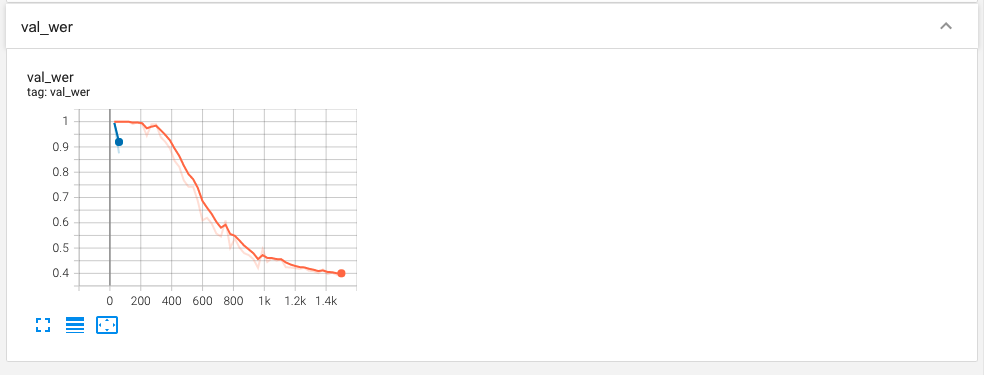

# Fall 2021 W251 Homework 12 - NLP and Speech

## Q&A Submission

### ASR with Nemo

1. Can you load and use Tensorboard? Please open port 6006 in your VM.

Yes. Please see Tensorboard images below.










2. Can you change the number of training epochs?

Changed the number of training epochs from 50 to 100. WER decreased from 0.95 to 0.75.

3. Please take a look at your model config file. Are you augmenting the dataset?

Yes.

```yaml
  spec_augment:
    _target_: nemo.collections.asr.modules.SpectrogramAugmentation
    rect_freq: 50
    rect_masks: 5
    rect_time: 120
```

4. Are you using pre-trained weights? If so, what are they?

Yes. The QuartzNet15x5Base-En model comes with pre-trained weights.

5. What is the sampling rate?

```yaml
    sample_rate: 16000
```

6. Does the learning rate change help?

Yes, changing the learning rate from 0.01 to 0.001 has helped in optimizing the model.

7. When fine tuning QuartzNet, does it help to use mixed precision?

Yes, using mixed precision will allow batch size to be increased and speed up model training process.

8. On what dataset[s] was the pre-trained QuartzNet model originally trained?

LibriSpeech-train and Mozillas Common Voice datasets.

### Voice commands with Nemo

1. What is the size of the dataset?

214

2. How many parameters does the model have?

77.2K

3. How long does it take to fine tune?

20sec