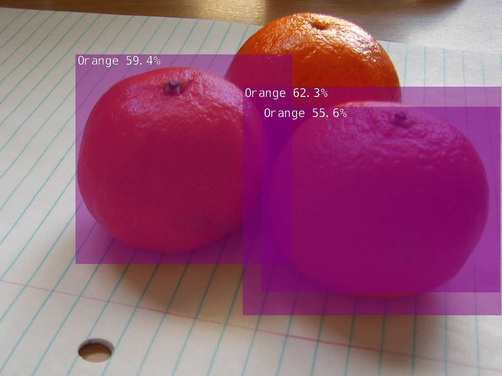
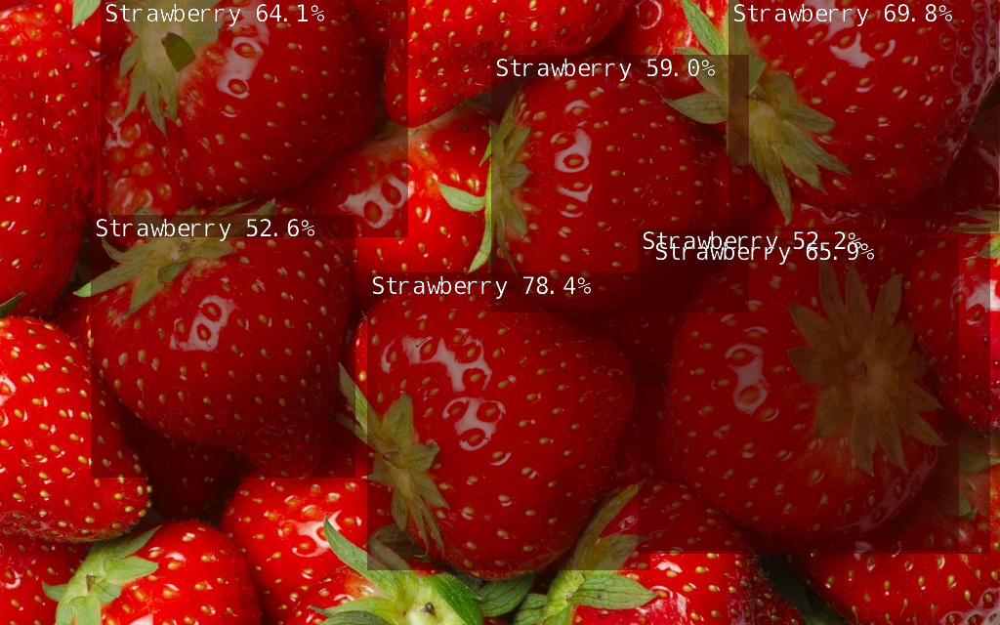

# Fall 2021 W251 Homework 6 - GStreamer and Model Optimization

## Files in Repo
- `ssd` folder obtained and configured based on [source](https://github.com/dusty-nv/jetson-inference)
- `listener.py` file contains python source code for Part 1 Question 4

## Part 1: GStreamer

**1. Convert the following sink to use nveglglessink.**
```
gst-launch-1.0 v4l2src device=/dev/video0 ! xvimagesink
```

**Answer:**
```
gst-launch-1.0 v4l2src device=/dev/video0 ! nvvidconv ! nvegltransform ! nveglglessink -e
```

**2. What is the difference between a property and a capability? How are they each expressed in the pipeline?**

**Answer:**

A property is used to modify or configure an element behavior, separated by spaces.

A capability describes the type of data streamed between two pads (element's interface to the outside world), separated by commas.

**3. Explain the following pipeline, that is explain each piece of the pipeline, describing if it is an element (if so, what type), property, or capability. What does this pipeline do?**
```
gst-launch-1.0 v4l2src device=/dev/video0 ! video/x-raw, framerate=30/1 ! videoconvert ! agingtv scratch-lines=10 ! videoconvert ! xvimagesink sync=false
```

**Answer:**
- `gst-launch-1.0`: Tool that runs GStreamer pipeline
- `v4l2src`: Video source element such as a web camera
- `device=/dev/video0`: Property that sets device location at /dev/video0
- `video/x-raw`: Capability that sets format to x-raw video feed
- `framerate=30/1`: Capability that sets frame rate of 30 fps
- `videoconvert`: Filter element that converts video format
- `agingtv scratch-lines=10`: Filter element that adds aging effect to video 
- `scratch-lines=10`: Property that adds scratch lines of 10 
- `videoconvert`: Filter element that converts video format
- `xvimagesink`: Sink element that outputs video
- `sync=false`: Property that pushes images to display immediately without sync-ing on the clock (higher CPU utilization)

**4. GStreamer pipelines may also be used from Python and OpenCV. Write a Python application that listens for images streamed from a Gstreamer pipeline ensuring that image displays in color.**

**Answer:**
- Source code: `listener.py`
- Gstreamer "server" pipeline used:
```
gst-launch-1.0 v4l2src device=/dev/video0 ! video/x-raw, framerate=30/1, width=640,height=480  ! nvvidconv ! omxh265enc insert-vui=1 ! h265parse ! rtph265pay config-interval=1 ! udpsink host=192.168.1.81 port=5000 sync=false -e 
```

## Part 2: Model optimization and quantization

In Lab 6, we leveraged TensorRT with TensorFlow. For this exercise, we'll look at another way to leverage TensorRT with Pytorch via the Jetson Inference library.

### Setting up `jetson-inference` container 
- [Source](https://github.com/dusty-nv/jetson-inference/blob/master/docs/aux-docker.md)

```
$ git clone --recursive https://github.com/dusty-nv/jetson-inference
$ cd jetson-inference
$ docker/run.sh
```
**1. The base model used that was trained using Jetson device and Jetson Inference scripts:**

**Answer:**

`mobilenet-v1-ssd-mp-0_675.pth`

### Train on fruit example 
- [Source](https://github.com/dusty-nv/jetson-inference/blob/master/docs/pytorch-ssd.md)

**2. A description of your dataset**

**Answer:**

`fruit` dataset was used with 8 classes of fruits.
- Apple
- Orange
- Banana
- Strawberry
- Grape
- Pear
- Pineapple
- Watermelon

There are 6360 total images. The commands and statistics distribution for the train/validation/test datasets are displayed below:

```
$ cd jetson-inference/python/training/detection/ssd
$ python3 open_images_downloader.py --stats-only --class-names "Apple,Orange,Banana,Strawberry,Grape,Pear,Pineapple,Watermelon" --data=data/fruit
```

```
-------------------------------------
 'train' set statistics
-------------------------------------
  Image count:  5145
  Bounding box count:  23539
  Bounding box distribution: 
    Strawberry:  7553/23539 = 0.32
    Orange:  6186/23539 = 0.26
    Apple:  3622/23539 = 0.15
    Grape:  2560/23539 = 0.11
    Banana:  1574/23539 = 0.07
    Pear:  757/23539 = 0.03
    Watermelon:  753/23539 = 0.03
    Pineapple:  534/23539 = 0.02
 

-------------------------------------
 'validation' set statistics
-------------------------------------
  Image count:  285
  Bounding box count:  825
  Bounding box distribution: 
    Strawberry:  326/825 = 0.40
    Grape:  153/825 = 0.19
    Orange:  148/825 = 0.18
    Apple:  102/825 = 0.12
    Watermelon:  31/825 = 0.04
    Pineapple:  25/825 = 0.03
    Banana:  22/825 = 0.03
    Pear:  18/825 = 0.02
 

-------------------------------------
 'test' set statistics
-------------------------------------
  Image count:  930
  Bounding box count:  2824
  Bounding box distribution: 
    Orange:  826/2824 = 0.29
    Strawberry:  754/2824 = 0.27
    Grape:  446/2824 = 0.16
    Apple:  329/2824 = 0.12
    Banana:  132/2824 = 0.05
    Watermelon:  125/2824 = 0.04
    Pear:  107/2824 = 0.04
    Pineapple:  105/2824 = 0.04
 

-------------------------------------
 Overall statistics
-------------------------------------
  Image count:  6360
  Bounding box count:  27188
```

### Download and train fruit dataset
```
# Download train dataset
$ python3 open_images_downloader.py --class-names "Apple,Orange,Banana,Strawberry,Grape,Pear,Pineapple,Watermelon" --data=data/fruit
```

```
# Begin training
python3 train_ssd.py --data=data/fruit --model-dir=models/fruit --batch-size=4 --epochs=30
```

```
# Resume training checkpoint
python3 train_ssd.py --data=data/fruit --model-dir=models/fruit  --resume=models/fruit/mb1-ssd-Epoch-28-Loss-3.7590008989424155.pth --batch-size=4 --epochs=30
```

**3. How long did it take to train the model, how many epochs were specified and batch size.**

**Answer:**

|   Edge Device   | Training Time | Number of Epochs | Batch Size |
|-----------------|---------------|------------------|------------|
| Jetson Nano 4GB | ~10 hrs       | 30               | 4          |

These are examples of image outputs based on the model:

 


**4. Native Pytorch baseline**

```
# batch size = 1
python3 valid_ssd.py --data=data/fruit --model-dir=models/fruit --resume=models/fruit/mb1-ssd-Epoch-28-Loss-3.7590008989424155.pth --batch-size=1 --epoch=1

# batch size = 4
python3 valid_ssd.py --data=data/fruit --model-dir=models/fruit --resume=models/fruit/mb1-ssd-Epoch-28-Loss-3.7590008989424155.pth --batch-size=4 --epoch=1

# 233it [01:05,  3.58it/s]
```

**Answer:**

`930it [01:17, 12.05it/s]`
- 12.05 images/sec after a run on 930 images

**5. TensorRT performance numbers**

### Converting the model to ONNX to be loaded with TensorRT
```
python3 onnx_export.py --model-dir=models/fruit
```
This will save a model called `ssd-mobilenet.onnx` under `jetson-inference/python/training/detection/ssd/models/fruit/`

### Processing Images with TensorRT
```
IMAGES=/jetson-inference/python/training/detection/ssd/data/fruit/test

# save images
# using /usr/local/bin/detectnet.py
detectnet.py --model=models/fruit/ssd-mobilenet.onnx --labels=models/fruit/labels.txt \
          --input-blob=input_0 --output-cvg=scores --output-bbox=boxes \
            "$IMAGES/*.jpg" $IMAGES/test/fruit_%i.jpg
            
# use this command for faster runtime
# does not save images
# using /jetson-inference/python/training/detection/ssd/detectnet.py
./detectnet.py --headless --model=models/fruit/ssd-mobilenet.onnx --labels=models/fruit/labels.txt --input-blob=input_0 --output-cvg=scores --output-bbox=boxes "$IMAGES/*.jpg"
```

Pytorch model uses FP32 and TensorRT model uses FP16. Thus, the optimized model is quantized.

```
[TRT]    detected model format - ONNX  (extension '.onnx')
[TRT]    desired precision specified for GPU: FASTEST
[TRT]    requested fasted precision for device GPU without providing valid calibrator, disabling INT8
[TRT]    [MemUsageChange] Init CUDA: CPU +198, GPU +0, now: CPU 222, GPU 2282 (MiB)
[TRT]    native precisions detected for GPU:  FP32, FP16
[TRT]    selecting fastest native precision for GPU:  FP16
[TRT]    attempting to open engine cache file models/fruit/ssd-mobilenet.onnx.1.1.8001.GPU.FP16.engine
[TRT]    loading network plan from engine cache... models/fruit/ssd-mobilenet.onnx.1.1.8001.GPU.FP16.engine
[TRT]    device GPU, loaded models/fruit/ssd-mobilenet.onnx
```

**Answer:**

- Total Images: 930
- Total Time Taken: 161.00596046447754
- Images/sec: 5.776183672437297