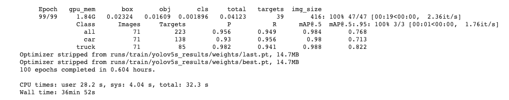

# Fall 2021 W251 Homework 8 - Fine tuning an object detector on a custom dataset

## Files in Repo
- `Roboflow_Train_YOLOv5.ipynb` notebook contains code for hw8
- `mAPresult.png` image shows mAP result

## Initial Set Up

```
# Reference: https://github.com/MIDS-scaling-up/v3/tree/main/week08/lab
# Spin up a docker container
docker run -ti -v ~/Desktop/W251/W251/hw8/data:/data/ ubuntu bash

# Install ffmpeg (in container)
apt update 
apt install -y ffmpeg

# Untar file
tar -xvf videos.tar

# Extract images to folder: 
ffmpeg -i 2021-06-13_19-22-13-front.mp4 -frames:v 400 -r 6 /data/hw8_images/extract%04d.jpg
```

## Result

- Used Roboflow instead of MakeSense AI to annotate images

 