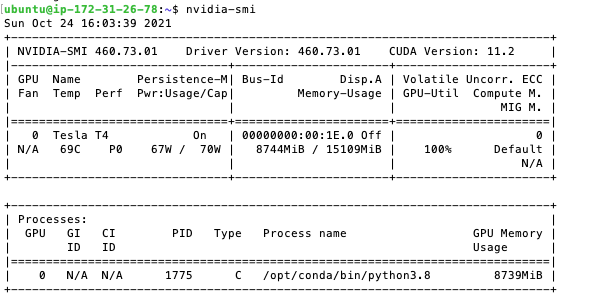

# Fall 2021 W251 Homework 9 - Distributed training

**Objective:** Focus on multi-node and multi-gpu (mnmg) model training on Imagenet dataset

**[What is DDP?](https://oboiko.medium.com/distributed-training-with-pytorch-d1fa5f57b40)**

Distributed Data Parallel (DDP) is a library in PyTorch which enables synchronization of gradients across multiple machines. What does it mean? It means that you can speed up model training almost linearly by parallelizing it across multiple GPUs. In other words, it will take roughly half the time to train the model on a machine with 2 GPUs vs machine with a single GPU.

**[How does it work?](https://oboiko.medium.com/distributed-training-with-pytorch-d1fa5f57b40)**

DDP works by creating a separate Python process for each GPU. Each process is using a non-overlapping subset of the data.

**[Terminology](https://oboiko.medium.com/distributed-training-with-pytorch-d1fa5f57b40)**

- world size - number of GPU devices on which training is happening
- rank - sequential id of a singly GPU device (e.g. 0)
- backend - manages GPU synchronization (e.g. nccl, gloo, tcp, mpi etc.) *nccl is recommended for distributed training over GPU


## Files in Repo
- `main.ipynb` main/master notebook
- `worker.ipynb` worker/slave notebook
- `single.ipynb` single GPU notebook
- `lab` folder for lab9 materials on Cinic dataset
- `images` folder for tensorboard and wandb trends

## Initial Set Up

### AWS
- Nvidia Deep Leaning AMI
- 2 g4dn.2xlarge ec2 instances 8 vCPU each
- 500 GB storage space each under /root
- Expose all inbound and outbound traffic

### Docker

```
docker run --gpus all --shm-size=2048m -it --rm --net=host -v /data:/data nvcr.io/nvidia/pytorch:21.08-py3
```

### Notebook

- Communication between 2 GPUs in two separate nodes

#### Assign nodes

```
RANK = 0 # main 
RANK = 1 # worker
```

#### Add below for both notebooks:
```
URL = 'tcp://<private IP of master>:<port number>' 
```

#### Set model on BOTH GPUs
```
model = torch.nn.parallel.DistributedDataParallel(model, device_ids=[GPU])
```

#### Distributed Sampler in Data Loader to distribute samples across GPUs

```
# train
train_loader = torch.utils.data.DataLoader(
        train_dataset, batch_size=TRAIN_BATCH, shuffle=False,
        num_workers=WORKERS, pin_memory=True, sampler=torch.utils.data.distributed.DistributedSampler(train_dataset))
```

```
# val
val_loader = torch.utils.data.DataLoader(
        val_dataset, batch_size=VAL_BATCH, shuffle=False,
        num_workers=WORKERS, pin_memory=True, sampler=torch.utils.data.distributed.DistributedSampler(val_dataset))
```

#### Initiate process group

```
dist.init_process_group(backend = BACKEND, init_method=URL, rank=RANK, world_size=WORLD_SIZE)
```

#### Tensorboard

```
from torch.utils.tensorboard import SummaryWriter
writer = SummaryWriter(log_dir="/data/runs/")
```

```
# Log examples
writer.add_scalar("Loss/train", loss, global_step = global_step)
writer.add_scalar("acc1/train", top1.avg, global_step = global_step)
writer.add_scalar("acc5/train", top5.avg, global_step = global_step)

writer.add_scalar("Loss/val", losses.avg, global_step = global_step)
writer.add_scalar("acc1/val", top1.avg, global_step = global_step)
writer.add_scalar("acc5/val", top5.avg, global_step = global_step)
writer.add_scalar("lr", scheduler.get_last_lr()[0], global_step = global_step)

# Notebook version
writer.close()
%reload_ext tensorboard
%tensorboard --logdir=/data/runs

# Port version
<publicIP-node>:6006 
```

#### wandb.ai

```
# Ensure wandb.com account is logged in
!pip install wandb
import wandb
wandb.login()
```

```
# Initiate project and configurations
wandb.init(project='hw9_main', 
           entity='rubyhan', 
           config = {
               "learning_rate": LR,
               "epochs": EPOCHS,
               "batch_size": TRAIN_BATCH,
               "momentum": MOMENTUM, 
               "weight_decay": WEIGHT_DECAY,
               "architecture": ARCH
           })
```

```
# Log examples
wandb.log({"Loss/train": loss, "acc1/train": top1.avg, "acc5/train": top5.avg
wandb.log({"Loss/val": losses.avg, 'acc1/val': top1.avg, 'acc5/val': top5.avg})
wandb.log({'lr': scheduler.get_last_lr()[0]})
```

### Command Line

#### Monitoring GPU utilization (>95%)

```
nvidia-smi
```




## Result

|  Node  |  Time  |  Acc@1  |  Acc@5  |
|--------|--------|---------|---------|
|  Main  | CPU times: user 1h 43min 25s, sys: 36min 31s, total: 2h 19min 57s <br>  Wall time: 1h 14min 47s | 32.204 | 58.120 | 
| Worker | CPU times: user 45min 29s, sys: 16min 18s, total: 1h 1min 47s <br>  Wall time: 1h 14min 49s | 32.216 | 58.184|
| Single | CPU times: user 1h 3min 42s, sys: 4min 36s, total: 1h 8min 18s <br> Wall time: 2h 24min 23s | 37.480 | 64.506 |